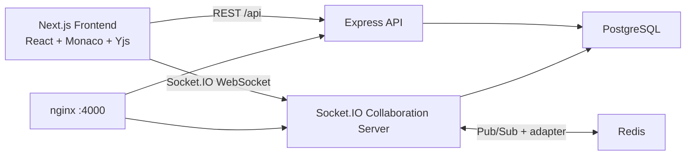

# CollabCode Technical Interview Guide

This document explains the project end to end so you can confidently discuss it in an interview: architecture, data model, APIs, realtime collaboration, security, deployment, tradeoffs, and likely follow-up questions.

## 1. Project Summary

CollabCode is a full-stack realtime collaborative code editor. Users can sign up, log in, create coding rooms, invite others by room link, edit shared files in Monaco Editor, see live presence, run code, and store room/file state in PostgreSQL.

The project is built as an npm workspace with two main apps:

- `frontend`: Next.js 14, React, TypeScript, Tailwind CSS, Monaco Editor, Socket.IO client, Yjs, Framer Motion, lucide-react.
- `backend`: Express, TypeScript, Socket.IO, PostgreSQL, Redis, JWT auth, bcrypt password hashing, Yjs document persistence.

The infrastructure files include:

- `docker-compose.yml`: full local stack with Postgres, Redis, two backend instances, nginx load balancer, and frontend.
- `docker-compose.infra.yml`: lightweight Postgres/Redis-only setup.
- `nginx.dev.conf`: load-balances WebSocket/API traffic across backend instances.
- `docs/deployment.md`: deployment notes.

## 2. Key Features

- Email/password signup and login.
- JWT-protected API routes.
- Room dashboard for creating and joining rooms.
- Owner/editor/viewer roles.
- Monaco-based collaborative editor.
- Multi-file room support with create, rename, delete, and folder-like paths.
- Realtime text synchronization using Yjs CRDT updates over Socket.IO.
- Awareness/presence updates for live users.
- Debounced persistence of document snapshots and Yjs binary state to PostgreSQL.
- Optional Redis adapter for multi-backend horizontal scaling.
- Code runner for programming languages plus browser-native previews/formatters for HTML, CSS, Markdown, JSON, XML, YAML, and plain text.
- Member marks and feedback API for interview/evaluation scenarios.

## 3. High-Level Architecture



The frontend handles UI, local editor state, auth storage, and socket connection setup. The backend owns authentication, authorization, persistence, code execution, and realtime room/file synchronization.

## 4. Frontend Architecture

Important paths:

- `frontend/app/page.tsx`: landing page.
- `frontend/app/login/page.tsx` and `frontend/app/signup/page.tsx`: auth screens.
- `frontend/app/rooms/page.tsx`: protected dashboard for room creation and joining.
- `frontend/app/rooms/[slug]/page.tsx`: room loader that fetches or joins a room.
- `frontend/components/collaborative-editor.tsx`: main editor UI and realtime binding.
- `frontend/components/file-tree.tsx`: room file/folder UI.
- `frontend/components/output-panel.tsx`: code execution and previews.
- `frontend/lib/api.ts`: REST client.
- `frontend/lib/auth.ts`: token/user localStorage helpers.
- `frontend/lib/collab-provider.ts`: custom Socket.IO + Yjs provider.
- `frontend/lib/piston.ts`: browser-native runners and backend execution bridge.

The frontend stores the JWT in `localStorage` under `collabcode.token` and the user profile under `collabcode.user`. Protected pages redirect to `/login` when the token is missing.

## 5. Backend Architecture

Important paths:

- `backend/src/server.ts`: Express app, middleware, routes, HTTP server, Socket.IO attachment.
- `backend/src/config/env.ts`: environment validation with Zod.
- `backend/src/db/pool.ts`: PostgreSQL connection pool.
- `backend/src/db/migrate.ts`: applies `schema.sql`.
- `backend/src/routes/auth.ts`: signup/login.
- `backend/src/routes/rooms.ts`: rooms, files, members, marks.
- `backend/src/routes/run.ts`: code execution.
- `backend/src/realtime/collaboration.ts`: Socket.IO/Yjs realtime engine.
- `backend/src/middleware/auth.ts`: JWT API guard.
- `backend/src/lib/tokens.ts`: JWT sign/verify helpers.

The backend validates configuration on startup. Required production-grade values include `DATABASE_URL` and a long `JWT_SECRET`.

## 6. Database Design

Schema file: `backend/src/db/schema.sql`.

Tables:

- `users`: stores user identity and bcrypt password hashes.
- `rooms`: stores room metadata, owner, name, and unique slug.
- `room_members`: many-to-many user-room membership with `owner`, `editor`, or `viewer` role.
- `documents`: stores files inside rooms, including `path`, `language`, text `snapshot`, and binary `yjs_state`.
- `room_member_marks`: stores marks and feedback per room member.

Important constraints:

- `users.email` is unique.
- `rooms.slug` is unique.
- `room_members` primary key is `(room_id, user_id)`.
- `documents` has a unique index on `(room_id, path)`.
- Room and document data cascade on delete through foreign keys.

## 7. Auth Flow

Signup:

1. Frontend posts name, email, and password to `POST /api/auth/signup`.
2. Backend validates input with Zod.
3. Password is hashed with bcrypt.
4. User is inserted into PostgreSQL.
5. Backend returns `{ token, user }`.
6. Frontend stores token/user and redirects to `/rooms`.

Login:

1. Frontend posts email/password to `POST /api/auth/login`.
2. Backend loads the user by email.
3. bcrypt compares the password with `password_hash`.
4. Backend returns a signed JWT.

Protected REST routes use `requireAuth`, which verifies the Bearer token and attaches `req.user`.

Socket connections also authenticate with JWT using `socket.handshake.auth.token`.

## 8. Room and File Flow

Create room:

1. User submits room name and language.
2. Backend creates a room slug.
3. Backend inserts a room, owner membership, and first document in one SQL CTE.
4. Initial document content comes from `initialSnapshotForLanguage`.

Join room:

1. User enters a slug or link.
2. Frontend extracts the slug.
3. Backend inserts membership as editor by default.
4. Existing membership keeps its original role.

Files:

- Editors/owners can create, rename, and delete files.
- Viewers can read files but cannot modify file structure.
- Backend prevents deleting the last file in a room.
- File changes emit `files:changed` over Socket.IO so connected users refresh the file tree.

## 9. Realtime Collaboration Flow

Main files:

- Frontend: `frontend/lib/collab-provider.ts`
- Backend: `backend/src/realtime/collaboration.ts`

Flow:

1. The frontend creates a `SocketYjsProvider` for the room.
2. The provider connects to Socket.IO with the JWT.
3. When a file opens, the provider emits `room:join` with slug and file ID.
4. Backend checks membership and document access.
5. Backend loads or creates an in-memory `Y.Doc`.
6. Backend returns encoded Yjs state.
7. Frontend applies the state to its local `Y.Doc`.
8. `MonacoBinding` binds `Y.Text("monaco")` to the Monaco model.
9. Local edits emit compact Yjs updates to the backend.
10. Backend applies updates, schedules persistence, broadcasts to other users, and optionally publishes through Redis.

Yjs is a CRDT, so concurrent edits merge without last-write-wins overwrites.

## 10. Persistence Strategy

The backend does not write every keystroke directly to PostgreSQL. Instead:

- It keeps active Yjs documents in memory.
- It marks documents dirty after updates.
- It saves after `SNAPSHOT_INTERVAL_MS`.
- It also attempts a final save when the last socket leaves a file.

Persisted data:

- `snapshot`: plain text version of the document for easy loading/display.
- `yjs_state`: encoded Yjs binary state for exact CRDT restoration.

Tradeoff:

- Benefit: lower database write load and smoother editing.
- Cost: a backend crash can lose edits made after the last snapshot interval.

## 11. Redis and Horizontal Scaling

Redis is optional. If Redis is unavailable, the app logs a warning and runs in single-instance mode.

When Redis is available:

- Socket.IO uses `@socket.io/redis-adapter`.
- Yjs updates are published to `collab:yjs`.
- Awareness updates are published to `collab:awareness`.
- Multiple backend instances can broadcast updates to users connected to different instances.

The Docker simulation runs two backend containers behind nginx to demonstrate this.

## 12. Authorization Model

Roles:

- `owner`: full room control, can rename/delete room, edit files, update marks.
- `editor`: can join, edit documents, manage files, update marks.
- `viewer`: can join and read, but cannot edit documents or files.

Authorization is enforced in both REST and socket paths:

- REST file routes require owner/editor for mutations.
- Socket `yjs:update` verifies membership and rejects viewer updates before applying document changes.
- Room rename/delete requires owner role.

This matters in interviews: frontend read-only mode is useful for UX, but real security must be enforced on the server.

## 13. Code Runner

Frontend behavior:

- HTML/CSS/Markdown render in browser preview iframes.
- JSON/XML/YAML/plaintext use local validation/formatting helpers.
- Programming languages call `POST /api/run`.

Backend behavior:

- Creates a temporary workspace.
- Writes source code to a file.
- Runs the matching local compiler/interpreter where configured.
- Uses a timeout to avoid long-running execution.
- Truncates large output.
- Removes the temporary workspace after execution.

Some languages need local tools installed, such as Python, Java, Go, Rust, PHP, Ruby, Swift, Kotlin, Dart, gcc/g++, Docker, or dotnet. Some runtimes can fall back to Piston for remote execution.

## 14. API Overview

Auth:

- `POST /api/auth/signup`
- `POST /api/auth/login`

User:

- `GET /api/me`

Rooms:

- `GET /api/rooms`
- `POST /api/rooms`
- `GET /api/rooms/:slug`
- `POST /api/rooms/:slug/join`
- `PATCH /api/rooms/:slug`
- `DELETE /api/rooms/:slug`

Members and marks:

- `GET /api/rooms/:slug/members`
- `PUT /api/rooms/:slug/members/:userId/marks`

Files:

- `GET /api/rooms/:slug/files`
- `POST /api/rooms/:slug/files`
- `PATCH /api/rooms/:slug/files/:fileId`
- `DELETE /api/rooms/:slug/files/:fileId`

Execution:

- `POST /api/run`

Health:

- `GET /api/health`

## 15. Environment Variables

Example values live in `.env.example`.

Important variables:

- `DATABASE_URL`: PostgreSQL connection string.
- `REDIS_URL`: optional Redis URL.
- `JWT_SECRET`: signing secret, minimum 24 characters.
- `JWT_EXPIRES_IN`: token expiry, default `7d`.
- `SNAPSHOT_INTERVAL_MS`: debounced save interval.
- `PORT`: backend port, default `4000`.
- `FRONTEND_ORIGIN`: production CORS origin.
- `NEXT_PUBLIC_API_URL`: frontend API base URL.
- `NEXT_PUBLIC_WS_URL`: frontend WebSocket URL.

## 16. Local Development Commands

Install:

```bash
npm install
```

Start infrastructure:

```bash
docker compose -f docker-compose.infra.yml up -d
```

Apply schema:

```bash
npm run db:migrate
```

Run backend:

```bash
npm run dev:backend
```

Run frontend:

```bash
npm run dev:frontend
```

Build everything:

```bash
npm run build
```

## 17. Deployment Notes

Production deployment needs:

- PostgreSQL database.
- Optional but recommended Redis for multi-instance WebSocket scaling.
- Secure `JWT_SECRET`.
- Correct `FRONTEND_ORIGIN`.
- Correct `NEXT_PUBLIC_API_URL` and `NEXT_PUBLIC_WS_URL`.
- A deployment target that supports WebSockets.

For multi-instance backend deployment, use sticky sessions or the Redis adapter. This project already includes the Redis adapter path.

## 18. What Was Fixed in This Pass

- Added server-side role enforcement for realtime Yjs updates. Viewers can no longer bypass the UI and send edit updates directly over the socket.
- Tightened frontend awareness cleanup by removing the correct local awareness client and destroying awareness during provider teardown.
- Corrected UI copy for the code runner so it describes the backend runner accurately.
- Verified the full workspace production build with `npm run build`.

## 19. Common Interview Questions and Strong Answers

### Why use Yjs instead of sending the whole document on every change?

Yjs sends compact CRDT updates and can merge concurrent edits deterministically. Sending the whole document would create race conditions, higher bandwidth usage, and last-write-wins conflicts.

### How does the app prevent unauthorized edits?

The UI makes viewers read-only, but the backend is the real enforcement point. REST mutations check role through SQL joins, and socket edit updates verify room membership and reject viewer updates before applying Yjs changes.

### Why store both `snapshot` and `yjs_state`?

`snapshot` is easy to inspect and use for plain text loading. `yjs_state` preserves the exact CRDT state, which is better for restoring collaborative documents without losing Yjs metadata.

### Why debounce database writes?

Writing every keystroke to PostgreSQL would be expensive and could slow the collaborative experience. Debounced snapshots reduce write load while keeping data reasonably fresh.

### What happens if Redis is down?

The app still works in single-backend mode. Cross-instance collaboration is not guaranteed without Redis because users connected to different backend instances may not receive each other's updates.

### How would you scale this app?

Use multiple backend instances with the Socket.IO Redis adapter, managed Redis, managed Postgres, WebSocket-capable load balancing, and monitoring. For heavier collaboration, consider document sharding, background persistence workers, and stronger crash recovery.

### How would you improve reliability?

Persist Yjs updates in an append-only event log, add periodic checkpoints, add automated integration tests with two clients, add health checks for Redis/Postgres, and add observability around socket connections and save failures.

### What are the main security concerns?

JWT secret management, password hashing, server-side role enforcement, CORS configuration, code execution sandboxing, rate limiting, output limits, and input validation.

### Is the code runner fully sandboxed?

It uses temporary workspaces, timeouts, and output limits, but local execution still depends on the host/container runtime. For production, code execution should run in a stricter sandbox such as isolated containers, microVMs, or a managed execution service.

### Why use Socket.IO instead of raw WebSockets?

Socket.IO gives reconnect behavior, fallback transports, rooms, event acknowledgements, and adapter support. That reduces custom networking code for a collaborative application.

## 20. Talking Points for Your Resume

- Built a realtime collaborative code editor using Next.js, Express, Socket.IO, and Yjs CRDTs.
- Implemented JWT authentication with bcrypt password hashing and role-based room access.
- Designed PostgreSQL schema for rooms, members, documents, marks, and durable Yjs snapshots.
- Added Redis-backed Socket.IO scaling for multi-instance collaboration.
- Implemented Monaco Editor integration with live collaborative text binding and awareness.
- Built a multi-language execution panel with browser previews and backend code execution.
- Added Docker Compose infrastructure with Postgres, Redis, nginx, frontend, and multiple backend instances.

## 21. Current Verification

The full workspace production build passes:

```bash
npm run build
```

This validates the Next.js frontend build, frontend type checks, and backend TypeScript compilation.
